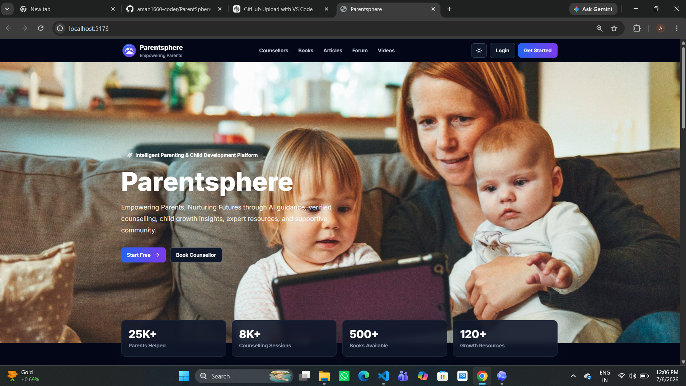
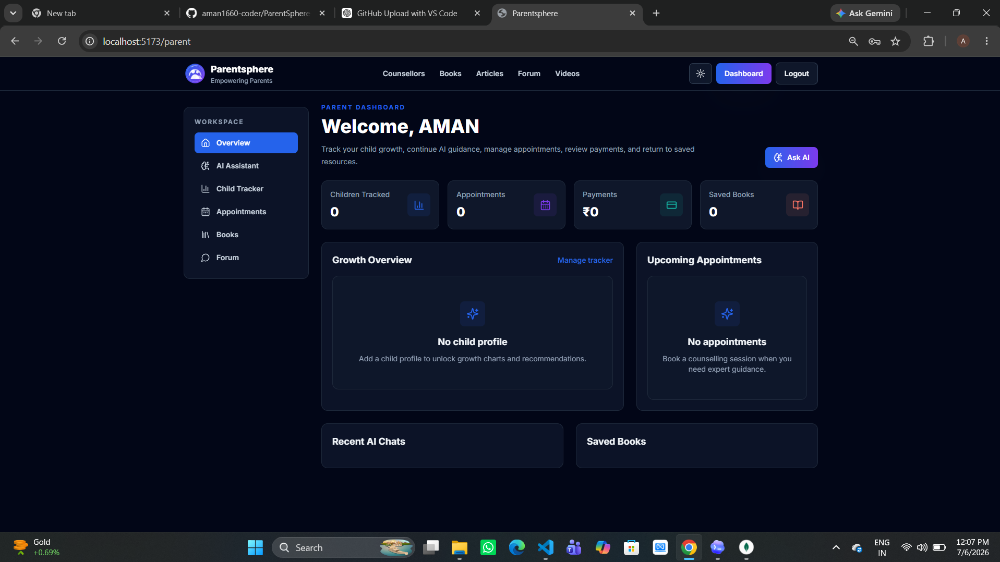
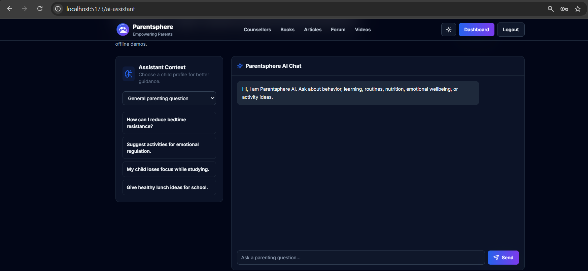
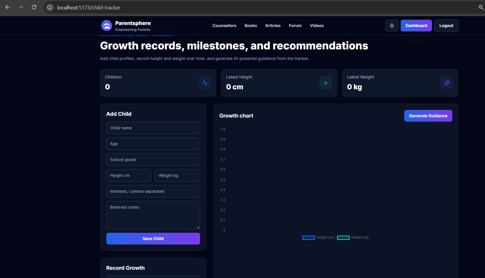
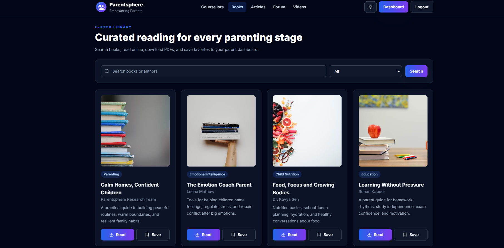
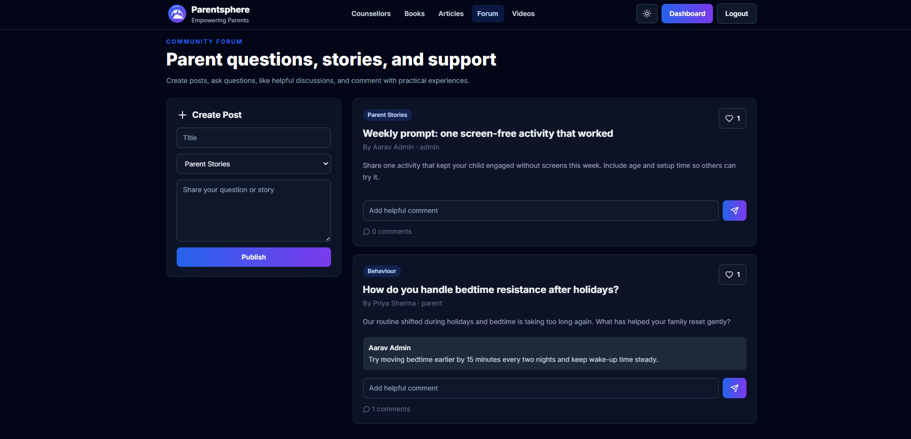
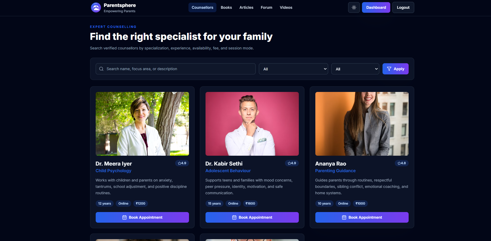
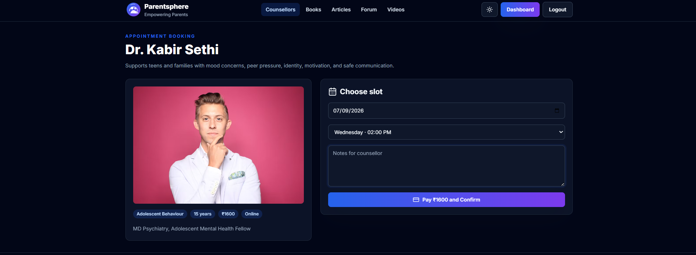
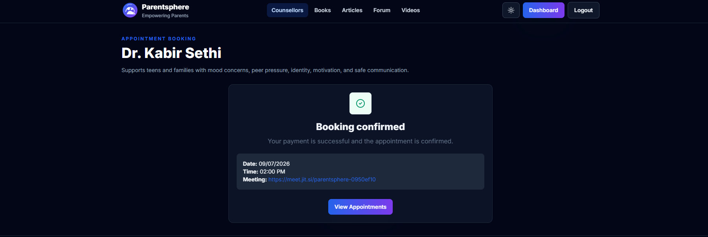
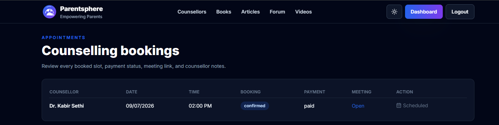

# ParentSphere AI

### AI-Powered Parenting, Child Development & Counselling Platform

ParentSphere AI is a full-stack web platform designed to support parents throughout different stages of child development. It combines AI-powered parenting guidance, child growth tracking, professional counselling, appointment booking, digital resources, community interaction, and role-based dashboards in a single application.

The platform is built using the MERN stack and integrates AI assistance, secure authentication, payment processing, email notifications, analytics, and interactive data visualization.

---

## Application Preview

### Home Page

The landing page introduces ParentSphere AI and provides quick access to counselling, educational resources, AI-powered guidance, and the parenting community.



---

### Parent Dashboard

The personalized parent dashboard provides an overview of children, appointments, payments, saved resources, recent AI conversations, and growth information.



---

### AI Parenting Assistant

The AI-powered parenting assistant provides contextual guidance for questions related to child behaviour, learning, nutrition, routines, emotional well-being, and parenting challenges.



---

### Child Growth Tracker

Parents can create child profiles, record height and weight, monitor development through interactive charts, and generate AI-powered guidance based on child information.



---

### Digital Book Library

The resource library provides curated parenting and child-development books with category filtering, search functionality, reading access, and bookmark support.



---

### Community Forum

Parents can create posts, ask questions, share experiences, comment on discussions, and interact with other members of the ParentSphere community.



---

### Counsellor Directory

Parents can discover professional counsellors, explore their specializations, experience, ratings, consultation modes, and fees before scheduling appointments.



---

### Appointment Booking & Payment

The booking system allows parents to select consultation dates, available time slots, add notes for counsellors, and complete the payment process.



---

### Booking Confirmation

After successful payment and appointment creation, the platform generates a confirmation containing the consultation date, time, and meeting information.



---

### Appointment Management

Parents can manage their counselling appointments and access booking status, payment details, schedules, and meeting links from a centralized dashboard.



---

## Key Features

### AI-Powered Parenting Assistance

- Context-aware parenting guidance
- AI responses for behaviour, education, nutrition, routines, and emotional well-being
- Child-profile-based contextual recommendations
- OpenAI API integration
- Built-in fallback assistant when an API key is unavailable
- AI-powered child development guidance

### Child Development Tracking

- Create and manage child profiles
- Record height and weight information
- Track child development over time
- Interactive growth visualization
- Store interests and behavioural observations
- Generate personalized AI recommendations

### Authentication & Authorization

- User registration and login
- JWT-based authentication
- Access and refresh token architecture
- Role-Based Access Control (RBAC)
- Parent dashboard
- Counsellor dashboard
- Admin dashboard
- Email verification
- Forgot and reset password functionality

### Professional Counselling

- Search counsellors
- Filter by specialization and availability
- View professional profiles
- Check consultation fees and experience
- Select appointment dates
- Choose available time slots
- Add consultation notes
- Track appointments
- Meeting link generation

### Payment Integration

- Razorpay payment integration
- Secure payment signature verification
- Payment status tracking
- Demo payment mode for offline project demonstrations

### Digital Resource Library

- Parenting e-books
- Child development resources
- Book search functionality
- Category-based filtering
- Save and bookmark resources
- Online reading and download support

### Articles & Educational Content

- Parenting articles
- Category-based content organization
- Likes and comments
- Admin content publishing
- Educational resources for different parenting stages

### Community Forum

- Create community posts
- Ask parenting questions
- Share experiences
- Comment on discussions
- Like helpful content
- Community interaction

### Video Resource Center

- Parenting courses
- Child-development videos
- Educational content
- Webinar resources

### Analytics & Administration

- User analytics
- Appointment statistics
- Revenue monitoring
- Counsellor management
- Resource management
- Book management
- Administrative dashboards

### Email Notifications

- Registration notifications
- Email verification
- Password reset emails
- Appointment notifications
- Booking confirmation
- Payment notifications

### Security

- JWT authentication
- Password hashing
- Helmet security middleware
- API rate limiting
- XSS protection
- MongoDB sanitization
- Input validation
- Secure payment signature verification
- Environment-based secret management

---

## Technology Stack

| Category | Technologies |
| --- | --- |
| Frontend | React.js, Vite, Tailwind CSS |
| Backend | Node.js, Express.js |
| Database | MongoDB, Mongoose |
| Authentication | JWT, Access Tokens, Refresh Tokens |
| Artificial Intelligence | OpenAI API, Built-in Fallback Assistant |
| Payments | Razorpay |
| Email Services | Nodemailer |
| Data Visualization | Interactive Growth Charts |
| Security | Helmet, Rate Limiting, XSS Protection, MongoDB Sanitization |
| Development Tools | Git, GitHub, VS Code, npm |

---

## System Architecture

ParentSphere AI follows a modern full-stack architecture:

```text
                          ParentSphere AI
                                 |
          +----------------------+----------------------+
          |                                             |
     React Frontend                               Express Backend
     Vite + Tailwind                                  Node.js
          |                                             |
          |                                     RESTful API Layer
          |                                             |
          +----------------------+----------------------+
                                 |
              +------------------+------------------+
              |                  |                  |
           MongoDB          AI Services        External Services
          Mongoose          OpenAI API         Razorpay Payment
                                |              Nodemailer Email
                         Fallback Engine
```

For detailed architecture documentation, see:

`docs/ARCHITECTURE.md`

---

## Core Application Workflow

```text
User Registration / Login
           |
           v
     JWT Authentication
           |
           v
     Role Identification
           |
     +-----+------+-------------+
     |            |             |
   Parent     Counsellor      Admin
     |            |             |
     v            v             v
 Dashboard    Dashboard     Analytics
     |
     +------------------------------+
     |              |               |
     v              v               v
 AI Assistant   Child Tracker   Resources
     |              |               |
     +--------------+---------------+
                    |
                    v
             Find Counsellor
                    |
                    v
             Select Time Slot
                    |
                    v
              Make Payment
                    |
                    v
           Booking Confirmation
                    |
                    v
             Meeting Access
```

---

## Project Structure

```text
Parentsphere/
│
├── backend/
│
├── client/
│
├── docs/
│   ├── screenshots/
│   │   ├── ai-assistant.png
│   │   ├── appointment-booking.png
│   │   ├── appointments-dashboard.png
│   │   ├── booking-confirmation.png
│   │   ├── books-library.png
│   │   ├── child-tracker.png
│   │   ├── community-forum.png
│   │   ├── counsellors.png
│   │   ├── home.png
│   │   └── parent-dashboard.png
│   │
│   ├── API.md
│   └── ARCHITECTURE.md
│
├── frontend/
│
├── server/
│
├── .env.example
├── .gitignore
├── package.json
├── package-lock.json
└── README.md
```

---

## Getting Started

### Prerequisites

Before running the project, make sure the following software is installed:

- Node.js
- npm
- MongoDB
- Git

---

## Installation

### 1. Clone the Repository

```bash
git clone https://github.com/aman1660-coder/ParentSphere-AI.git
```

### 2. Navigate to the Project Directory

```bash
cd ParentSphere-AI
```

### 3. Install Dependencies

```bash
npm install
```

### 4. Configure Environment Variables

Create the required environment files using the provided example configuration.

For the server:

```bash
cp .env.example server/.env
```

For the frontend:

```bash
cp .env.example frontend/.env
```

Configure the required environment variables according to your development environment.

### 5. Seed the Database

```bash
npm run seed
```

### 6. Start the Application

```bash
npm run dev
```

Open the application in your browser:

```text
http://localhost:5173
```

---

## Demo Accounts

The application includes local seeded accounts for development and demonstration purposes.

| Role | Email | Password |
| --- | --- | --- |
| Admin | admin@parentsphere.com | Admin@12345 |
| Parent | parent@parentsphere.com | Parent@12345 |
| Counsellor | counsellor@parentsphere.com | Counsellor@12345 |

> **Note:** These credentials are intended only for local development and demonstration. Do not use these credentials in a production deployment.

---

## MongoDB Configuration

For local development with MongoDB Compass:

```text
mongodb://127.0.0.1:27017/parentsphere
```

For MongoDB Atlas, update `MONGODB_URI` in the server environment configuration and run:

```bash
npm run seed
```

---

## Available Scripts

```bash
npm run dev
```

Starts the Express backend and Vite frontend concurrently.

```bash
npm run build
```

Creates a production build of the React frontend.

```bash
npm run start
```

Starts the Express API server.

```bash
npm run seed
```

Seeds the database with development and demonstration data.

---

## AI Configuration

ParentSphere AI supports OpenAI integration for intelligent parenting guidance.

If `OPENAI_API_KEY` is configured, the application uses AI-powered responses for parenting assistance and child-development recommendations.

If the API key is unavailable, ParentSphere uses a deterministic fallback assistant that generates practical guidance using the user's message and available child-profile context.

This enables the application to remain functional for offline demonstrations and development environments.

---

## Payment Configuration

ParentSphere AI integrates Razorpay for appointment payments.

The payment system includes:

- Payment initialization
- Secure signature verification
- Payment status management
- Appointment confirmation
- Demo payment support

If Razorpay credentials are unavailable, the project supports a demonstration payment workflow for local development.

---

## API Documentation

Detailed API information is available at:

`docs/API.md`

---

## Architecture Documentation

Detailed information about the application architecture and data flow is available at:

`docs/ARCHITECTURE.md`

---

## Development Highlights

This project demonstrates practical implementation of:

- Full-stack MERN application development
- RESTful API design
- Artificial Intelligence integration
- Context-aware AI assistance
- Secure authentication and authorization
- Role-Based Access Control
- MongoDB database design
- Payment gateway integration
- Email notification systems
- Interactive data visualization
- Community-based application features
- Security middleware implementation
- Scalable frontend and backend architecture

---

## Future Enhancements

- Real-time chat between parents and counsellors
- Video consultation integration
- Advanced AI conversation memory
- Child growth percentile comparison
- Mobile application development
- Push notifications
- Multi-language support
- Advanced counsellor analytics
- AI-powered resource recommendations
- Personalized parenting learning paths
- Cloud deployment and CI/CD integration
- Automated testing and monitoring

---

## Disclaimer

ParentSphere AI is designed as a parenting support and educational platform. AI-generated guidance and platform resources are intended for informational purposes and should not replace professional medical, psychological, or emergency services.

---

## Author

**Aman Kumar Singh**

Computer Science Engineering  
Specialization in IoT, Cyber Security and Blockchain Technology

GitHub: `aman1660-coder`

---

## Support

If you find this project useful or interesting, consider giving the repository a star.

Contributions, suggestions, and feedback are welcome.

---

<p align="center">
  <strong>ParentSphere AI</strong>
</p>

<p align="center">
  Empowering Parents. Supporting Children. Building Better Futures.
</p>