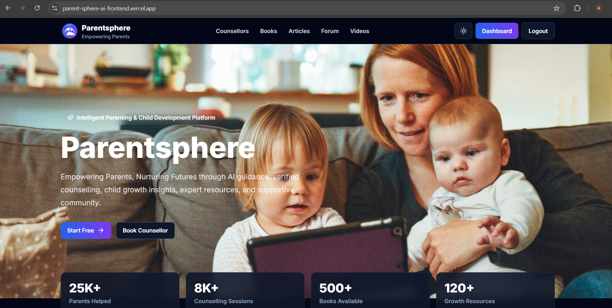
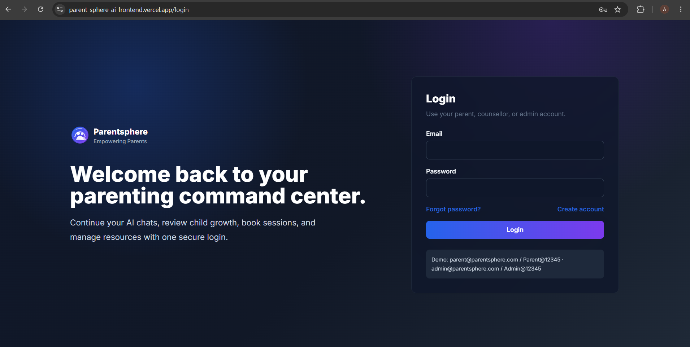
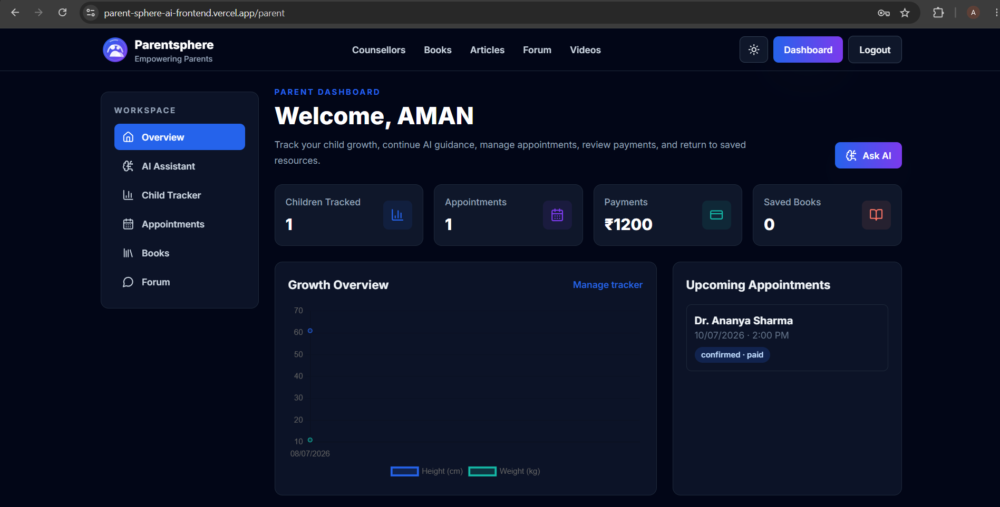
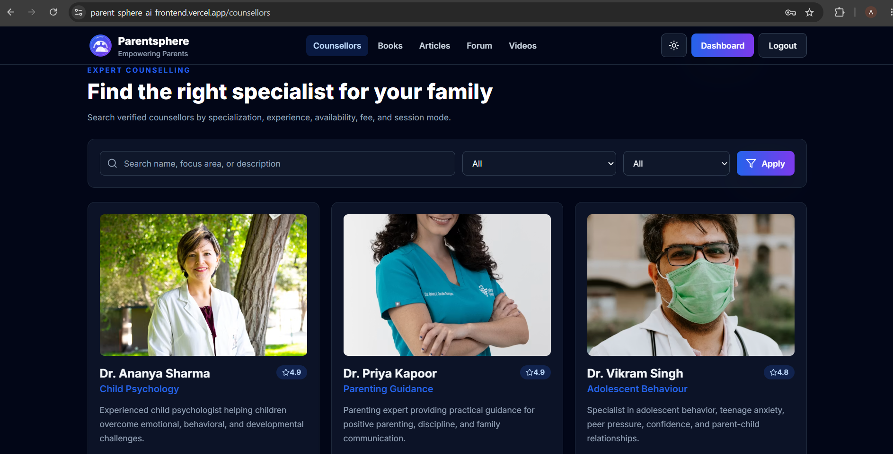
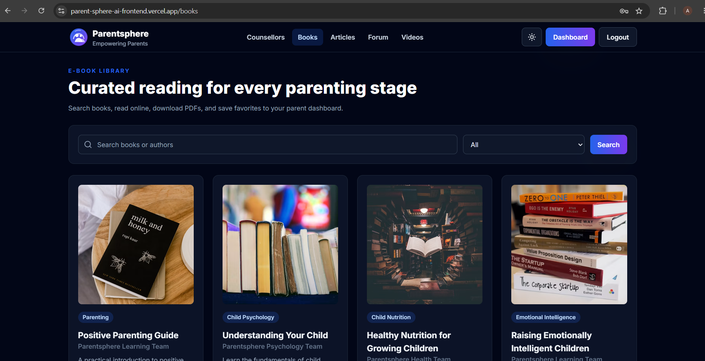
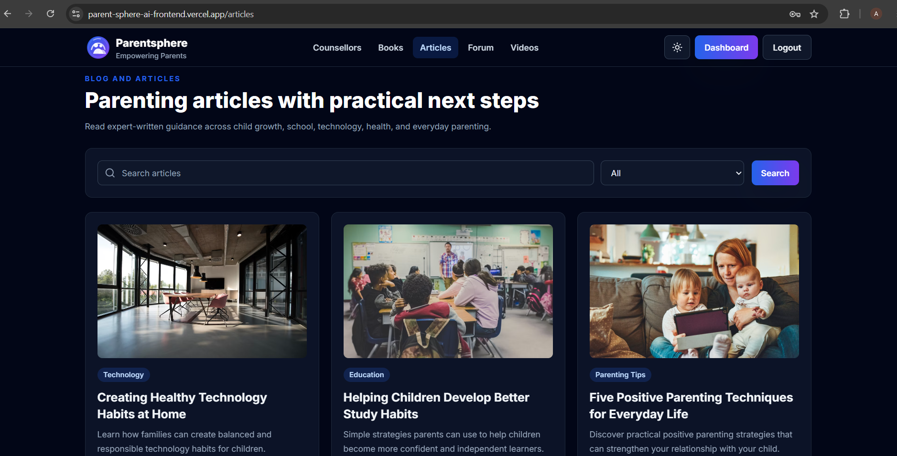
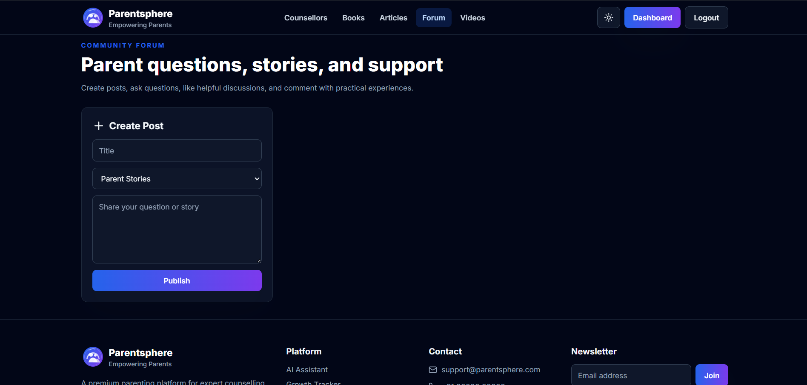
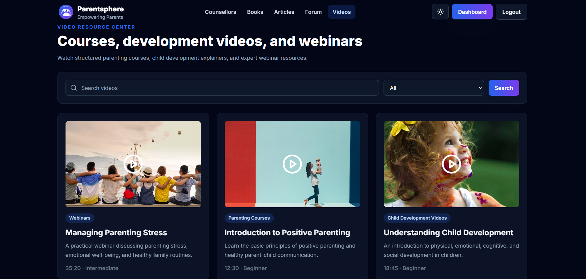
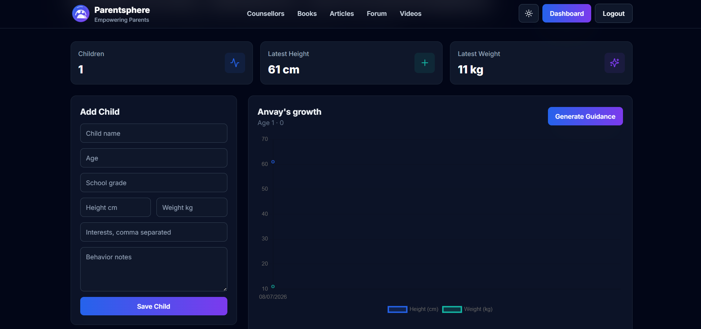
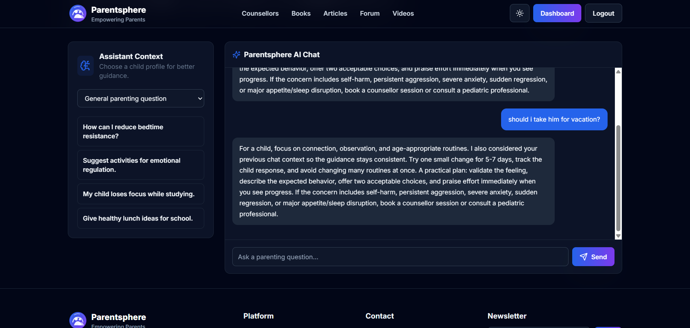

<div align="center">

# 👨‍👩‍👧‍👦 ParentSphere

### AI-Powered Parenting Support & Child Development Platform

**A production-deployed full-stack MERN application that brings AI-powered parenting guidance, child growth tracking, professional counselling, educational resources, appointment management, and community support into one unified digital platform.**

<br>

[](https://parent-sphere-ai-frontend.vercel.app/)

<br>


<br>

### 🌐 [View Live Application](https://parent-sphere-ai-frontend.vercel.app/)

</div>

---

## 📌 About ParentSphere

**ParentSphere** is a full-stack parenting support and child development platform designed to solve a real-world problem: parents often need to use multiple disconnected applications for counselling, child development tracking, educational resources, parenting guidance, and community interaction.

ParentSphere brings these services together into a single, modern, and user-friendly platform.

The application allows parents to:

- 🤖 Receive AI-powered parenting guidance
- 👶 Create and manage child profiles
- 📈 Track child growth and development
- 👩‍⚕️ Discover professional counsellors
- 📅 Book and manage counselling appointments
- 💳 Track counselling payments
- 📚 Access parenting books and educational resources
- 📰 Read practical parenting articles
- 💬 Participate in community discussions
- 🎥 Watch parenting courses, webinars, and child development videos
- 📊 Access a personalized parent dashboard

The application follows a modern **MERN stack architecture** and is deployed using independent frontend, backend, and cloud database services.

---

# 🚀 Live Application

<div align="center">

## [🌐 Launch ParentSphere](https://parent-sphere-ai-frontend.vercel.app/)

**Frontend:** Deployed on Vercel  
**Backend:** Deployed on Render  
**Database:** MongoDB Atlas

</div>

---

# 📸 Application Preview

## 🏠 Modern Landing Page

ParentSphere provides a modern and responsive landing page introducing users to the platform and its major parenting support services.

The landing page highlights the platform's core objective of empowering parents through AI guidance, professional counselling, child development tools, expert resources, and community support.



---

## 🔐 Secure User Authentication

ParentSphere provides secure user authentication with account registration and login functionality.

The authentication system enables personalized platform access and supports different application roles.

### Authentication Features

- User registration
- Secure login
- Password protection
- JWT-based authentication
- Protected routes
- Role-based access
- Persistent user sessions



---

## 📊 Personalized Parent Dashboard

After authentication, parents receive access to a personalized dashboard that provides a centralized overview of their activities across the platform.

The dashboard displays:

- Number of children being tracked
- Upcoming counselling appointments
- Payment information
- Saved books
- Child growth overview
- Quick access to the AI assistant



---

## 👩‍⚕️ Professional Counsellor Discovery

ParentSphere allows parents to explore professional counsellors based on their parenting and child development requirements.

### Counsellor Features

- Professional counsellor profiles
- Specialization information
- Experience details
- Ratings and reviews
- Counselling fees
- Online, offline, and hybrid modes
- Search functionality
- Specialization filters
- Appointment integration



---

## 📚 Parenting E-Book Library

The integrated e-book library provides educational resources across multiple parenting and child development categories.

### Book Categories

- Parenting
- Child Psychology
- Emotional Intelligence
- Child Nutrition
- Education
- Communication Skills

Users can search for books, filter resources by category, read available content, and save useful books.



---

## 📰 Parenting Articles

The article section provides practical educational content covering important parenting and child development topics.

### Article Categories

- Child Growth
- Parenting Tips
- Education
- Technology
- Health

The platform supports searchable and categorized content to help users quickly discover relevant information.



---

## 💬 Community Forum

ParentSphere includes a community discussion platform where parents can interact and share their experiences.

### Community Features

- Create discussion posts
- Ask parenting questions
- Share personal experiences
- Select discussion categories
- Like useful discussions
- Comment on community posts
- Learn from other parents



---

## 🎥 Video Resource Center

The video resource center provides structured multimedia content for parents.

### Available Resources

- Parenting courses
- Child development videos
- Educational webinars
- Beginner-level resources
- Intermediate-level resources
- Advanced learning content



---

## 📈 Child Growth Tracker

The Child Growth Tracker enables parents to create child profiles and monitor important development information.

### Tracked Information

- Child name
- Age
- School grade
- Height
- Weight
- Interests
- Behaviour observations

Growth information is presented through visual charts to help parents monitor changes over time.



---

## 🤖 AI-Powered Parenting Assistant

One of the major features of ParentSphere is its AI-powered parenting assistant.

The assistant provides contextual guidance for common parenting questions and challenges.

Parents can ask questions related to:

- Child behaviour
- Study habits
- Emotional regulation
- Healthy routines
- Nutrition
- School activities
- Parent-child communication
- General parenting challenges

The assistant can use selected child profile information to provide more relevant and personalized guidance.



---

# ✨ Core Features

| Feature | Description |
|---|---|
| 🔐 Secure Authentication | User registration and login system |
| 👥 Role-Based Access | Support for parent, counsellor, and admin roles |
| 📊 Parent Dashboard | Personalized overview of platform activities |
| 🤖 AI Assistant | Context-aware parenting guidance |
| 👶 Child Profiles | Create and manage child information |
| 📈 Growth Tracking | Monitor child height and weight development |
| 📉 Data Visualization | Visual representation of growth information |
| 👩‍⚕️ Counsellor Discovery | Explore parenting and child development specialists |
| 🔍 Search & Filtering | Find counsellors and resources efficiently |
| 📅 Appointments | Book and manage counselling sessions |
| 💳 Payments | Maintain counselling payment information |
| 📚 E-Book Library | Access parenting and educational resources |
| 📰 Articles | Explore practical parenting content |
| 💬 Community Forum | Create posts and interact with other parents |
| 🎥 Video Resources | Access courses, webinars, and development videos |
| ☁️ Cloud Database | Persistent MongoDB Atlas data storage |
| 🌐 REST APIs | Communication between frontend and backend |
| 🚀 Cloud Deployment | Independently deployed frontend and backend |

---

# 🏗️ System Architecture

```text
                         ┌──────────────────────────┐
                         │          USER            │
                         │       Web Browser        │
                         └────────────┬─────────────┘
                                      │
                                      │ HTTPS
                                      ▼
                         ┌──────────────────────────┐
                         │      REACT FRONTEND      │
                         │                          │
                         │     Vite + React.js      │
                         │     Hosted on Vercel     │
                         └────────────┬─────────────┘
                                      │
                                      │ REST API Requests
                                      │ JSON Responses
                                      ▼
                         ┌──────────────────────────┐
                         │      NODE.JS BACKEND     │
                         │                          │
                         │       Express.js         │
                         │      REST API Layer      │
                         │     Hosted on Render     │
                         └────────────┬─────────────┘
                                      │
                                      │ Mongoose ODM
                                      ▼
                         ┌──────────────────────────┐
                         │      MONGODB ATLAS       │
                         │                          │
                         │   Cloud Database Layer   │
                         │   Persistent Data Store  │
                         └──────────────────────────┘
```

---

# 🛠️ Technology Stack

## 💻 Frontend

| Technology | Purpose |
|---|---|
| React.js | Component-based user interface |
| Vite | Frontend development and build tool |
| JavaScript | Application functionality |
| HTML5 | Application structure |
| CSS3 | Styling and responsive design |
| REST API Integration | Frontend-backend communication |

---

## ⚙️ Backend

| Technology | Purpose |
|---|---|
| Node.js | JavaScript runtime environment |
| Express.js | Backend framework and REST API development |
| Mongoose | MongoDB Object Data Modeling |
| JWT | Authentication and authorization |
| Middleware | Request validation and route protection |

---

## 🗄️ Database

| Technology | Purpose |
|---|---|
| MongoDB | NoSQL database |
| MongoDB Atlas | Cloud database hosting |
| Mongoose ODM | Schema design and database interaction |

---

## ☁️ Deployment & Development Tools

| Technology | Purpose |
|---|---|
| Vercel | Frontend deployment |
| Render | Backend deployment |
| MongoDB Atlas | Cloud database infrastructure |
| Git | Version control |
| GitHub | Source code management |
| VS Code | Development environment |

---

# 🗄️ Database Architecture

ParentSphere uses multiple MongoDB collections to provide modular and scalable data management.

```text
MongoDB Atlas
│
└── parentsphere
    │
    ├── users
    │
    ├── children
    │
    ├── counsellors
    │
    ├── appointments
    │
    ├── payments
    │
    ├── books
    │
    ├── articles
    │
    ├── videos
    │
    ├── forumposts
    │
    ├── aichats
    │
    ├── testimonials
    │
    ├── newsletters
    │
    └── contactmessages
```

---

# 📂 Project Structure

```text
Parentsphere/
│
├── client/
│
├── docs/
│   │
│   ├── screenshots/
│   │   ├── 01-home-page.png
│   │   ├── 02-login-page.png
│   │   ├── 03-parent-dashboard.png
│   │   ├── 04-counsellors-page.png
│   │   ├── 05-books-library.png
│   │   ├── 06-articles-page.png
│   │   ├── 07-community-forum.png
│   │   ├── 08-video-resources.png
│   │   ├── 09-child-growth-tracker.png
│   │   └── 10-ai-parenting-assistant.png
│   │
│   ├── API.md
│   └── ARCHITECTURE.md
│
├── frontend/
│   │
│   ├── src/
│   │   ├── components/
│   │   ├── pages/
│   │   └── ...
│   │
│   ├── public/
│   ├── package.json
│   └── vite.config.js
│
├── server/
│   │
│   ├── config/
│   ├── controllers/
│   ├── middleware/
│   ├── models/
│   ├── routes/
│   ├── seed/
│   ├── src/
│   ├── utils/
│   ├── app.js
│   ├── server.js
│   └── package.json
│
├── .gitignore
├── package.json
└── README.md
```

---

# ⚙️ Getting Started

Follow the instructions below to run ParentSphere locally.

## 1️⃣ Clone the Repository

```bash
git clone YOUR_GITHUB_REPOSITORY_URL
```

Navigate to the project directory:

```bash
cd Parentsphere
```

---

## 2️⃣ Install Project Dependencies

Install root dependencies:

```bash
npm install
```

Install frontend dependencies:

```bash
cd frontend
npm install
```

Install backend dependencies:

```bash
cd ../server
npm install
```

---

## 3️⃣ Configure Environment Variables

Create a `.env` file inside the `server` directory.

```env
NODE_ENV=development

PORT=5000

CLIENT_URL=http://localhost:5173

MONGODB_URI=your_mongodb_atlas_connection_string

JWT_ACCESS_SECRET=your_secure_access_token_secret

JWT_REFRESH_SECRET=your_secure_refresh_token_secret

ACCESS_TOKEN_EXPIRES=15m

REFRESH_TOKEN_EXPIRES=7d

OPENAI_API_KEY=your_api_key_if_required

RAZORPAY_KEY_ID=your_key_if_required

RAZORPAY_KEY_SECRET=your_secret_if_required
```

> ⚠️ Never commit `.env` files, MongoDB credentials, JWT secrets, API keys, or payment credentials to GitHub.

---

## 4️⃣ Seed the Database

ParentSphere includes a database seeding script that can populate the database with initial application content.

Navigate to the server directory:

```bash
cd server
```

Run:

```bash
node seed/seed.js
```

Expected output:

```text
MongoDB connected successfully.

Deleting existing counsellors, books, articles and videos...

Adding new data...

========================================
DATABASE SEEDED SUCCESSFULLY
========================================

Counsellors: 6
Books: 4
Articles: 4
Videos: 3

========================================
```

---

## 5️⃣ Start the Backend Server

From the `server` directory:

```bash
npm run dev
```

The development backend will run on:

```text
http://localhost:5000
```

---

## 6️⃣ Start the Frontend

Open another terminal and navigate to the frontend directory:

```bash
cd frontend
```

Run:

```bash
npm run dev
```

The frontend development server will run on:

```text
http://localhost:5173
```

---

# 🔐 Security Implementation

ParentSphere incorporates several application security practices:

- JWT-based authentication
- Password protection
- Protected API routes
- Authentication middleware
- Role-based access control
- Environment variable management
- MongoDB Atlas authentication
- CORS configuration
- Frontend and backend service separation
- Secure cloud database connectivity

---

# 🌐 REST API Architecture

The frontend communicates with the Express backend using RESTful APIs.

The API architecture handles operations related to:

```text
/api/auth
/api/users
/api/children
/api/counsellors
/api/appointments
/api/payments
/api/books
/api/articles
/api/videos
/api/forum
/api/ai
```

> For additional API information, see [`docs/API.md`](docs/API.md).

---

# 🚀 Deployment Architecture

| Application Layer | Platform |
|---|---|
| Frontend | Vercel |
| Backend | Render |
| Database | MongoDB Atlas |
| Source Code | GitHub |

### Deployment Flow

```text
Developer
    │
    │ Git Push
    ▼
GitHub Repository
    │
    ├──────────────────────┐
    │                      │
    ▼                      ▼
Vercel                  Render
    │                      │
    ▼                      ▼
React Frontend       Node.js Backend
                           │
                           ▼
                     MongoDB Atlas
```

The React frontend communicates with the deployed backend through REST APIs.

The backend handles:

- Application business logic
- Authentication
- Authorization
- Database operations
- AI assistant functionality
- Appointment management
- User-generated content

MongoDB Atlas provides persistent cloud-based storage for the application.

---

# 🎯 Problem Statement

Parents often depend on multiple disconnected platforms for:

- Professional counselling
- Child development monitoring
- Educational resources
- Parenting guidance
- Community discussions
- Growth tracking
- Appointment management

This fragmentation makes it difficult for parents to maintain a centralized understanding of their child's development and quickly access relevant support.

**ParentSphere addresses this problem by creating an integrated digital parenting ecosystem where AI guidance, development tracking, professional support, learning resources, and community interaction are accessible through one unified platform.**

---

# 💡 What Makes ParentSphere Different?

ParentSphere goes beyond a traditional CRUD-based academic project.

The application combines multiple real-world software development concepts, including:

- Full-stack application development
- Cloud database architecture
- AI-assisted user interaction
- Authentication and authorization
- Role-based access control
- Personalized user dashboards
- Child development tracking
- Data visualization
- REST API development
- Search and filtering
- Community interaction
- Professional service discovery
- Appointment management
- Cloud deployment
- Independent frontend and backend infrastructure

The project demonstrates the development and deployment of a complete software ecosystem rather than an isolated frontend or backend implementation.

---

# 🧠 Key Technical Learnings

Developing ParentSphere involved working with:

- Full-stack MERN architecture
- REST API design
- React component architecture
- State and user session management
- JWT authentication
- Protected application routes
- MongoDB schema design
- Mongoose models and relationships
- Cloud database configuration
- Environment variable management
- CORS configuration
- Frontend-backend integration
- Production deployment
- Database seeding
- Debugging production API connectivity
- Managing independently deployed application services

---

# 🔮 Future Enhancements

Future development plans for ParentSphere include:

- 📹 Real-time video counselling
- 💬 Live parent-counsellor chat
- 📧 Email appointment notifications
- 🔔 Real-time application notifications
- 🧠 Advanced AI personalization
- 📊 AI-based child development insights
- 📈 Advanced parent analytics dashboard
- 🤖 Personalized resource recommendation system
- 🌍 Multi-language support
- 📱 Dedicated mobile application
- 📲 Progressive Web App support
- 👨‍⚕️ Advanced counsellor dashboard
- 🛡️ Expanded admin analytics and moderation tools

---

# 👨‍💻 Developer

<div align="center">

## Aman Kumar Singh

### Computer Science Engineering Student

**Specialization in IoT, Cyber Security and Blockchain Technology**

<br>

Interested in building applications using:

`Full-Stack Development` • `Artificial Intelligence` • `Cyber Security` • `Blockchain` • `IoT` • `Cloud Technologies`

<br>

### 🌐 [View Live Project](https://parent-sphere-ai-frontend.vercel.app/)

</div>

---

# 🤝 Contributing

Contributions, suggestions, and feature requests are welcome.

To contribute:

1. Fork the repository.
2. Create a new feature branch.
3. Make your changes.
4. Commit the changes.
5. Push the branch.
6. Open a Pull Request.

---

# ⭐ Support This Project

If you found ParentSphere interesting or useful, consider giving the repository a ⭐.

It helps support the project and its continued development.

---

<div align="center">

# 👨‍👩‍👧‍👦 ParentSphere

### Empowering Parents • Supporting Children • Building Better Futures

<br>

**Built with ❤️ by Aman Kumar Singh**

<br>

[](https://parent-sphere-ai-frontend.vercel.app/)

</div>