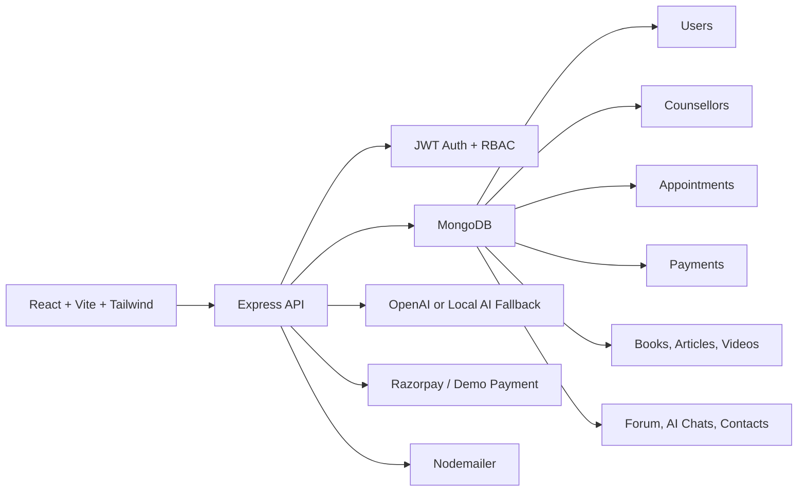
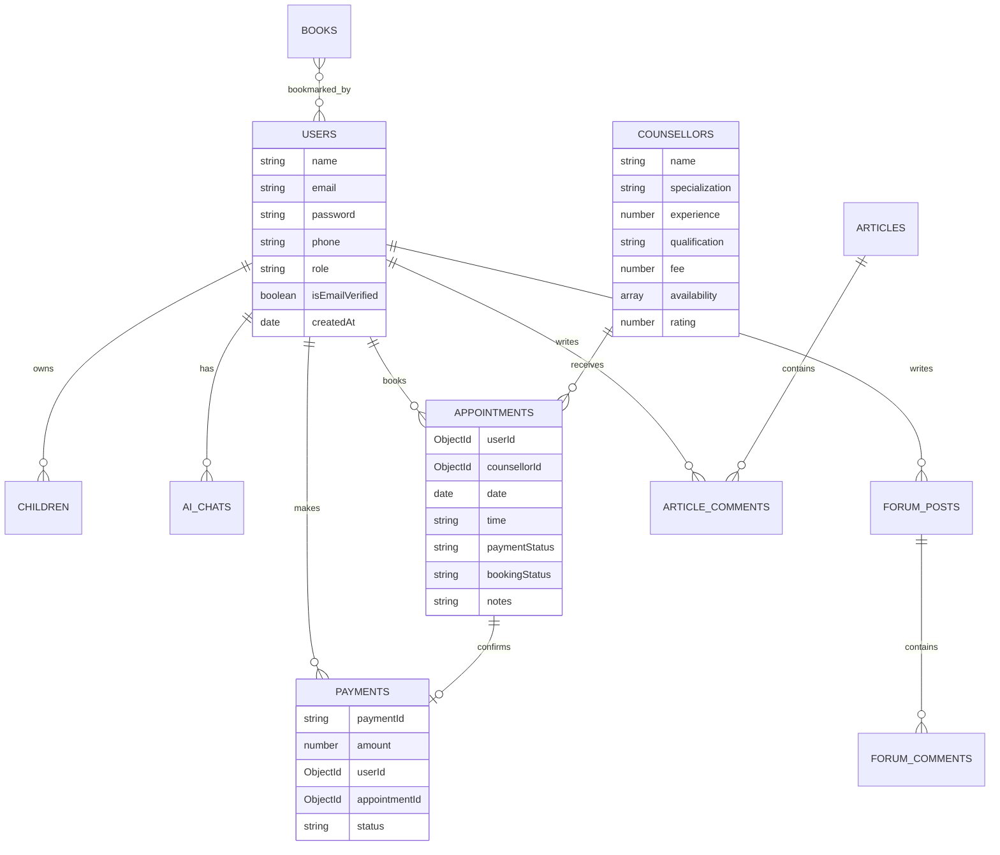

# Architecture

```mermaid
flowchart LR
  Browser["React + Vite + Tailwind"] --> API["Express API"]
  API --> Auth["JWT Auth + RBAC"]
  API --> Mongo["MongoDB"]
  API --> AI["OpenAI or Local AI Fallback"]
  API --> Pay["Razorpay / Demo Payment"]
  API --> Email["Nodemailer"]
  Mongo --> Users
  Mongo --> Counsellors
  Mongo --> Appointments
  Mongo --> Payments
  Mongo --> Resources["Books, Articles, Videos"]
  Mongo --> Community["Forum, AI Chats, Contacts"]
```

## Database ER Diagram

```mermaid
erDiagram
  USERS ||--o{ CHILDREN : owns
  USERS ||--o{ AI_CHATS : has
  USERS ||--o{ APPOINTMENTS : books
  USERS ||--o{ PAYMENTS : makes
  USERS ||--o{ FORUM_POSTS : writes
  USERS ||--o{ ARTICLE_COMMENTS : writes
  COUNSELLORS ||--o{ APPOINTMENTS : receives
  APPOINTMENTS ||--o| PAYMENTS : confirms
  BOOKS }o--o{ USERS : bookmarked_by
  ARTICLES ||--o{ ARTICLE_COMMENTS : contains
  FORUM_POSTS ||--o{ FORUM_COMMENTS : contains

  USERS {
    string name
    string email
    string password
    string phone
    string role
    boolean isEmailVerified
    date createdAt
  }
  COUNSELLORS {
    string name
    string specialization
    number experience
    string qualification
    number fee
    array availability
    number rating
  }
  APPOINTMENTS {
    ObjectId userId
    ObjectId counsellorId
    date date
    string time
    string paymentStatus
    string bookingStatus
    string notes
  }
  PAYMENTS {
    string paymentId
    number amount
    ObjectId userId
    ObjectId appointmentId
    string status
  }
```
